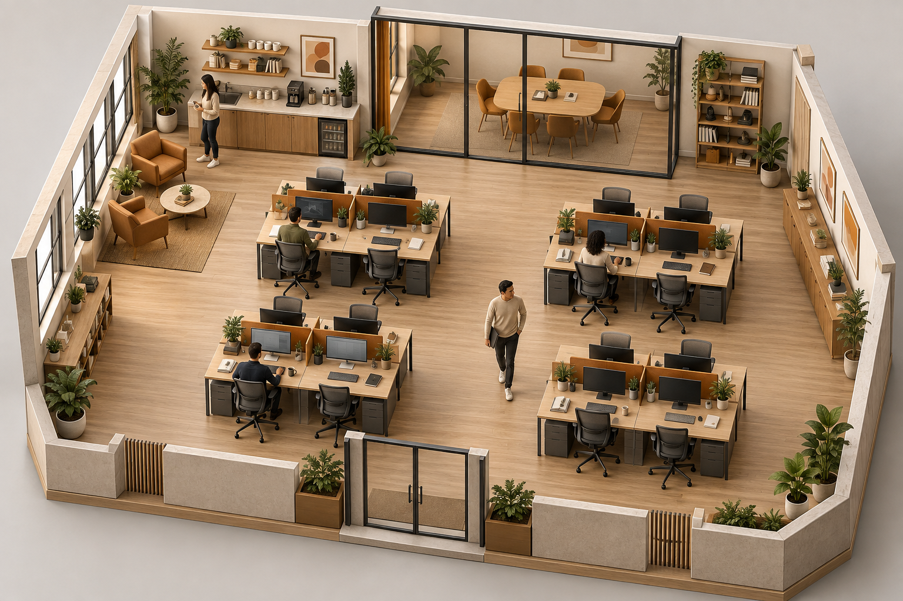
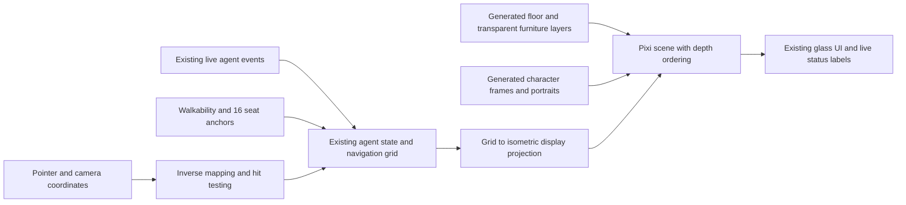

# Zuri warm miniature office — approved 2.5D contract

Date: 2026-10-05. Approval: APPROVED by the user after reviewing Concept 01 and this specification. User requested replacing pixel art with newly generated, more detailed and realistic 2.5D art, then selected a warm realistic miniature office. Complexity escalated from C-2 to C-3 after renderer inspection: projected coordinates, depth ordering and interaction mapping must change together. Risk HIGH within the scene-rendering subsystem; no backend/schema migration is proposed.

## Concrete visual proposal

**Concept 01**, generated with built-in image_gen. SHA256 `eb26e90b59b6c7dc48f3e49dc9d363f12c3c2af28f7b6f9a8412972a79f8f37f`. The [exact prompt and inspection](design/zuri-2.5d-concept-01-prompt.md) accompany the image. It is art direction, not an app screenshot, calibrated coordinate map or production atlas. At approval, the baseline was app 0.1.1 at source f9423262ab7c0f02693ebdf762bb9b23f10264e8. Version 0.2.0 implementation and measured outcomes are recorded in [verification](ZURI-2.5D-VERIFICATION.md).

Warm oak grain, ivory plaster, textured upholstery, brushed metal, glass partitions, soft daylight/contact shadows and restrained amber accents. Smooth edges and realistic miniature scale. Adult characters have natural proportions, fabric and hair detail; no pixel/voxel/chibi treatment. Preserve Zuri glass UI and restrained motion around the scene.

## Parent and peer review

- Parent: docs/ZURI-MVP.md and docs/ARCHITECTURE.md preserve Electron, React, Pixi, IPC, terminal and event planes. This proposal replaces the MVP's procedural SVG scene-art decision only after approval; it does not replace agent runtime behavior.
- Peer: docs/ZURI-UI.md, docs/ZURI-GLASS-MOTION.md and PRODUCT.md preserve semantic Zuri colors, glass shells, focus behavior and reduced motion. The new art extends their visual contract.
- Current constraints: TiledMapRenderer uses an orthogonal tile grid; Character uses grid-derived pixel positions and seated sprite cropping; CharacterSprite uses small direction/animation frames. global.css requests pixelated/crisp-edge rendering for canvas/images/SVG. SpritePortrait and portraitArt supply pixel portraits outside the office canvas. Replacing only a background PNG would leave these conflicts unresolved.

## Scope

1. Replace the office floor/walls/furniture with coherent, high-resolution prerendered 2.5D layers, preserving 16 usable desk anchors, entrance, meeting and coffee areas. The concept establishes style; exact floorplan is calibrated to the runtime grid rather than copied blindly from generated pixels.
2. Replace office character art and UI portraits consistently. Preserve all 15 existing avatar IDs, saved names, roles and agent selection. Prepare transparent character frames for existing walk directions, idle and seated states, with consistent scale, lighting and foot anchors. No static people baked into the runtime background.
3. Keep Pixi as the renderer. Separate navigation coordinates from projected display coordinates, include inverse mapping for pointer interactions, and depth-sort furniture/agents so they pass behind desks and sit at the correct location. Use smooth texture sampling for the new art and scope CSS changes to relevant surfaces. Calibration applies transient furniture footprints to navigation while preserving the persisted map, all 16 seat IDs and every required destination; visible props and collision consume the same placement contract. This prevents the new solid furniture from occupying formerly walkable aisles.
4. Preserve labels, status indicators, desk activity, task/message interaction, camera controls and the Reduced Motion contract. No animation pretending a real agent is working; state continues to come from existing events.

No new 3D engine, camera rotation, office editor, weather/day cycle, backend/provider changes, data migration or dependency upgrade is proposed. Generic UI icons are not rebranded as part of this office-art request.

## Proposed scene structure

A single flattened illustration is insufficient for animated occlusion. Asset generation proceeds in separately inspectable layers; generated anatomy/frame consistency, alpha edges and seating alignment must be checked before integration. The approved image is a visual quality target, not a guarantee that generated frames will need no correction.

## Execution and acceptance

1. Generate calibrated floor/furniture/character assets and record prompt, version, dimensions, alpha requirements and SHA256. Verify material/camera consistency and no baked-in agents or UI text.
2. Implement the bounded renderer changes. Test projection/inverse round trips, reachable paths from entrance to every desk, selection at projected positions, correct depth ordering and seated alignment. Existing IDs and persisted agents must remain compatible.
3. Verify real agent state, terminal/editor continuity, click selection, movement, seating, existing camera fit/nudge, light/dark UI and reduced motion in the packaged app. Inspection confirmed the baseline has no manual zoom/pan controls, so preserving camera behavior does not add those controls. Confirm new textures render smoothly at 1280x800 and 1440x960 without clipped controls or illegible status text. Hover/selection exposes full in-scene names; agent cards retain all names so dense offices remain legible.
4. Typecheck/build and relevant regression checks; compare failures against 0.1.1 baseline rather than declaring an unqualified pass. Record startup/texture memory and frame timings with 1 and 16 displayed agents, including simultaneous terminal output. Any controlled fixture must be labeled.
5. Produce app 0.2.0 / snapshot 2.0.0 only after integration and verification: before/after screenshots, short video showing movement/occlusion/selection, exact source commit and artifact hashes. Keep v0.1.1 evidence and binaries intact.

Exit criteria: no pixel art in the delivered office, its actors or their UI portraits; coherent high-detail warm miniature style; working spatial interactions; measured performance; preserved agent/terminal behavior; documentation and versioned evidence. None of these implementation gates is claimed passed by generating Concept 01.

## Version diff

| Existing 0.1.1 | Proposed 0.2.0 |
|---|---|
| Orthogonal SVG tile office and pixel actors | Generated detailed 2.5D office, layered furniture and matching actors |
| Pixel portraits in agent surfaces | Matching smooth, detailed portraits with stable avatar IDs |
| Pixel coordinate placement/cropping | Projected placement, inverse hit mapping and calibrated depth/seating |
| Zuri glass and Motion feedback | Same approved UI treatment surrounding the new art |

The initial proposal added only the specification, generation record and Concept 01. The user subsequently approved implementation. Generated runtime assets, scene changes and verification now proceed under that approval; final measured outcomes are recorded separately from this contract. Three generated adult anatomies with five garment variants preserve fifteen avatar IDs; this does not claim fifteen independently generated people. Controlled status events used to test seating are explicitly synthetic renderer fixtures, not successful model work.
