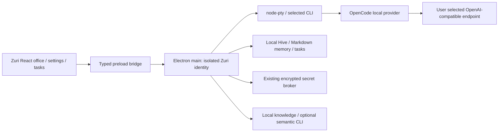

# Zuri desktop MVP contract

Authorization: the user's 2026-10-05 attached implementation brief expressly authorizes reversible work through delivery, including parallel agents, without stopping at a proposal. This document records that supplied scope before implementation. Complexity C-3; risk HIGH (desktop identity, provider secrets, native runtime).

## Parent and peer alignment

Base: HarnessMD/munder-difflin at 428223ac55b50367e158a77c48984816dfddcc52. Preserve the Electron/React/TypeScript architecture in ARCHITECTURE.md, terminal/event planes, typed preload IPC, Hive and secret broker contracts. Internal god/cast/cth identifiers remain compatible. Version becomes 0.1.0 independently of upstream.

Design/feature reference only: Freshair129/zuri.ai at 332b88c9277ee0995798f125f99d5343e7d493f0, docs/UI-DESIGN-SYSTEM.md, ADR-010 and agent domain charter. Adopt Amber Citrus #E8820C, neutral surfaces, readable typography, semantic status with text, progressive disclosure and focused task views. Use installed system fonts; do not copy unlicensed reference assets/code. Its LINE/ERP/multitenant services are outside this desktop MVP. MSP and GKS remain future explicit contracts.

## Architecture

## Binding decisions

- Product Zuri; package zuri-agent-office; appId ai.zuri.agentoffice; data folder ZuriAgentOffice under Electron appData set before state constructors. Protocol zuri-agent-office. No implicit upstream data import. Explicit ZURI_USER_DATA_DIR may isolate QA runs.
- No release destination is authorized: packaging publish disabled, updates manual-only, no upstream installers. Product analytics disabled and no upstream promotional/model-catalog background request.
- Default coordinator display name Zuri Coordinator; roster labels become team roles. Preserve existing permission/autonomy semantics and show their meaning.
- Replace bundled restricted office atlases/maps with original procedural SVG/Tiled scene, preserve required seat anchors/pathfinding. Preserve upstream copyright and historical attribution. Original simple vector wordmark/icon, no third-party brand assets.
- Reuse existing localBaseUrl/localModel config and encrypted secret broker. Settings allow engine, endpoint, model, optional key and explicit connection/tool probe. OpenCode local selection pins local provider/model, sends no other stored cloud keys, and never silently falls back to cloud. Errors distinguish URL/auth/model/tool/CLI/connectivity problems. No automatic backend startup or credential discovery.
- Preserve working agent, terminal, Hive messaging, task, stop and restart persistence paths. Do not claim live inference based on fixtures.

## Execution DAG and ownership

T0 source/license/baseline -> T1 this contract -> T2/T3/T4 in parallel -> T5 integrate -> T6 review/verify -> T7 package/report.

| Owner | Exclusive files |
|---|---|
| Lead/integrator | package.json, lockfile, electron-builder.yml, electron.vite.config.ts, main/index.ts, preload/index.ts, build icons, README/provenance/notices/report |
| UI/brand | renderer except AiEnginesSettings.tsx and env bridge types; shared/godIdentity.ts; display tests; original scene/assets |
| Runtime | main/config.ts, updater.ts, analytics.ts, runtimeIdentity.ts, modelCatalog.ts; shared updateState/hire and runtime tests |
| Provider | AiEnginesSettings.tsx; new shared/main localProvider.ts; local-provider tests; proposed central patches sent to lead |

## Acceptance and exit

A: record exact baseline commands, runtime versions and pre-existing failures. B: Zuri identity/assets/legal/update behavior verified. C: typecheck/build, meaningful regression tests, Electron ABI load for node-pty and SQLite. D: real desktop launch/onboarding/workspace/agent/PTY/task/status/stop/restart; explicitly distinguish fixture, live CLI/model, untested and blocked. E: Windows artifacts; installer build/open/install are separate outcomes. README Thai plus English quick start, UPSTREAM, notices, integration seams, verification report and actual screenshot when available. Core workflow not passed means MVP remains incomplete.

## Version diff

Initial contract 0.1.0: scoped fork and reference design established; no upstream code changes at document creation.
