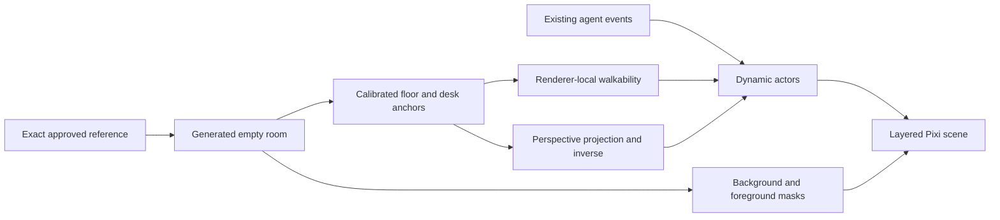

# Reference-faithful office correction

Authorization: correction to the already approved Concept 01 implementation, explicitly clarified by the user's marked reference on 2026-10-05. This records the existing requested outcome, not a new feature proposal. C-3; risk HIGH within scene coordinates/rendering. Parent architecture remains Electron/React/Pixi with unchanged event/terminal/provider planes. Peer glass, motion and avatar identity contracts remain applicable. Supersedes the 0.2.0 interpretation that retaining old displayed desk positions takes priority over the reference composition.

## Required result

Use `design/zuri-2.5d-concept-01.png` as the exact visual source. Preserve the elevated frontal perspective, realistic warm oak/plaster materials, enclosing walls and front entrance. Rear glass room is MEETING. Four four-seat workstation pods occupy the central/front WORKER area. Kitchenette remains rear-left; lounge remains left. The red annotations are explanatory and must not appear in the product.

Generate an empty environment from the exact reference, retaining furniture and architecture while removing all people. Dynamic actors remain separate: no baked-in workers and no simulated work presented as real. Preserve the sixteen seat identifiers including coordinator reservation and all fifteen avatar identifiers; remap their renderer-local positions to the new floorplan. Recalibrate all ambient/task/meeting/cafe destinations, collisions, perspective inverse mapping, camera bounds, depth and hit selection as one scene contract. No backend or saved-agent schema migration.

## Execution and acceptance

1. Generate and inspect the empty room against the source. Reject loss of glass meeting room, four pods, left lounge/kitchenette, enclosing walls or coherent camera. Record exact prompt and image hash.
2. Implement projection, layout and occlusion against this image. Verify inverse round trips, every desk/destination reachable, stable IDs and collision around visible solid furniture.
3. Verify packaged UI with 1/16 actors, real mouse selection, movement and labeled synthetic seating. Actor heads/hips/feet must fit chairs from both sides of pods; check foreground walls, desks and glass. Retain reduced motion and terminal/editor continuity.
4. Capture reference and actual scene side by side. Explicit visual review must assess architecture, zone placement, four-pod geometry, camera, scale, lighting and actor integration. Functional tests cannot waive a mismatch.
5. Produce version 0.3.0 and snapshot 3.0.0 with source/artifact hashes, before/after and videos only after those gates. Preserve 0.2.0 binaries/evidence; mark their overall reference-fidelity acceptance as rejected.

## Version diff

0.2.0: diamond isometric floor, sixteen separate desks, open meeting table, individually generated furniture.

0.3.0 target: reference-derived enclosed office, elevated frontal perspective, four worker pods and rear glass meeting room, with navigation and dynamic actors fitted to the reference.
