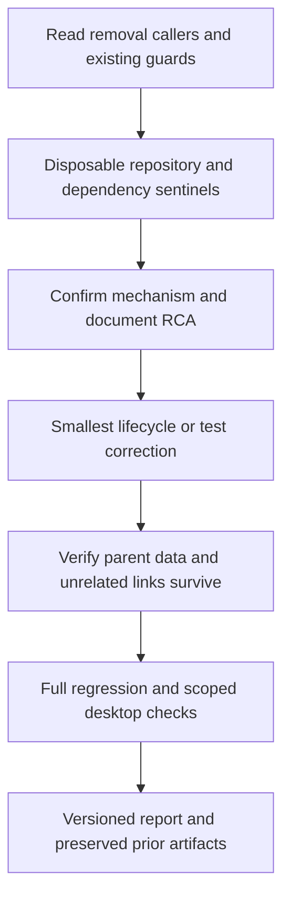

# Approved stabilization after Zuri 0.3.0

Date: 2026-10-05, Asia/Bangkok. Baseline source: `9572b5ac1da6019f0cfa97af0c647e62f6e07b7a`. The user approved this plan and the subsequent UI layout direction with “ลุย”. Patch target 0.3.1 requires verification. Authorization covers bounded disposable tests, not deletion of real user worktrees.

## Assumption and alignment

The user explicitly selected “ตรวจและแก้ข้อผิดพลาด 22 รายการก่อน”, then approved implementation with “ลุย”. Complete stabilization before changing the UI shell. The subsequent layout uses the existing office, agent state and runtime features; its execution contract is recorded separately.

Parent: [MVP](ZURI-MVP.md) requires preservation of agents, terminals, tasks, persistence and truthful runtime acceptance. [PRODUCT](../PRODUCT.md) retains the approved office design. Peers: [reference verification](ZURI-REFERENCE-VERIFICATION.md), [local provider verification](LOCAL-PROVIDER-VERIFICATION.md), existing worktree lifecycle and path-containment tests. Keep the approved 0.3.0 scene, identities, provider routing, disabled telemetry and disabled remote model refresh.

Complexity: **C-3**. Risk: **HIGH**, because the highest-priority investigation concerns worktree deletion and dependency links. Test-only corrections are lower risk individually. No architecture replacement, dependency upgrade or schema migration is proposed.

## Evidence and priorities

The preserved `output/playwright/reference-suite.log` has 983 results: 947 pass, 22 fail and 14 skip. It ran before final 0.3.0 meeting/seated calibrations; this is historical evidence, not a fresh run on the committed source. Failure names match the earlier baseline exactly in [comparison](evidence/reference-suite-comparison.json).

| Group | Count | Observed evidence | Next action |
|---|---:|---|---|
| Filesystem containment fixtures | 10 | `fs-path-containment.test.cjs` fails during fixture creation with symlink EPERM, before containment assertions | Separate capability/setup failure from product behavior; verify genuine file-link containment in a capable test environment |
| Worktree dependency lifecycle | 5 | One parent sentinel becomes ENOENT after removal; two fixture symlinks report EPERM; one platform error-code mismatch; one Git-status assumption fails | First investigate parent-data preservation, then correct platform-specific fixtures/assertions without weakening protections |
| Source-text assertions | 4 | Terminal automation, hire cap handler and two telemetry seam checks reject source text; telemetry logs contain CRLF while patterns require LF | Inspect actual behavior and extraction boundaries; use robust checks while preserving the intended contracts |
| Config path expectation | 1 | `/workspace/project` expected, `O:\workspace\project` returned | Verify normalization contract before using platform-correct expectations |
| Hook-server late-root fixture | 1 | `hooks.sock` listener reports EACCES after root becomes available | Compare fixture socket address with production Windows transport; reproduce in an isolated test |
| Catalog consistency | 1 | Local `docs/model-catalog.json` differs from baked `src/shared/modelCatalog.json` | Define the local source of truth and reconcile the packaged contract; do not re-enable network refresh |

### First investigation: preserve parent dependencies

`test/worktree-deps.test.cjs:78` creates a disposable repository, a `must-survive.txt` sentinel in its base dependencies and a linked worktree. The recorded test confirms the link and successful `removeWorktree`, then fails reading the parent sentinel at line 92. `src/main/worktreeDeps.ts` creates a junction on Windows; `src/main/git.ts:277` invokes `git worktree remove --force` directly. This supports investigating junction traversal during removal, but does not yet establish every production caller's behavior or the precise platform mechanism. Do not describe all five worktree failures as harmless environment failures.

Before a fix, inspect all removal callers and document confirmed RCA under `.brain/rca/`, including symptom, evidence, root cause, why it escaped and prevention. Any reproduction must use a newly created disposable repository inside an explicitly resolved QA root on O:, verify target boundaries before removal, and retain sentinels outside the candidate worktree. Do not run it against user repositories or change machine-wide symlink/security settings.

## Proposed sequence and acceptance

1. Reproduce the worktree parent-sentinel failure safely and fix only the confirmed cause. Verify parent dependencies survive, unrelated links/real directories are preserved, and callers retain their existing dirty/unintegrated-work guards. Unknown path/link state must not lead to destructive cleanup.
2. Reproduce and classify the remaining failures individually. Correct test portability only when the underlying behavior is demonstrated. No wholesale skips, relaxed containment, reinstated analytics or network refresh to obtain a green result. Unsupported file symlinks remain explicitly NOT_RUN/SKIP with a reason and an identified capable-environment check.
3. Run focused regressions, full TypeScript/build and one full suite on the final source. Report exact pass/fail/skip counts and any changes from baseline. A clean summary requires no unresolved failures on supported paths; skipped platform/security coverage is never counted as PASS.
4. If product behavior changes, package 0.3.1 and exercise the changed desktop lifecycle in an isolated profile. Preserve 0.3.0 binaries and Snapshot 3.0.0. Produce Snapshot 3.0.1 with actual changed-flow screenshots, version/source/ASAR hashes and a concise version diff. If only tests/docs change, do not manufacture a new app release.

## Scope boundary

Further character/gait/lounging art, live-model task completion, installer installation, signing, publishing and external integrations are separate work. The earlier provider report records a repeat-task partial result; this remains open and is the proposed follow-on after stabilization. No changes to the approved visual design in this round.

## Version diff

Plan 0.1.0: first proposed reliability phase after reference-fidelity delivery. Current app and approved visual behavior remain 0.3.0. No implementation or new test result is claimed by this plan.

Plan 0.2.0: implementation approved; stabilization precedes the approved sidebar/office/agent-drawer UI phase. Results remain subject to verification.
